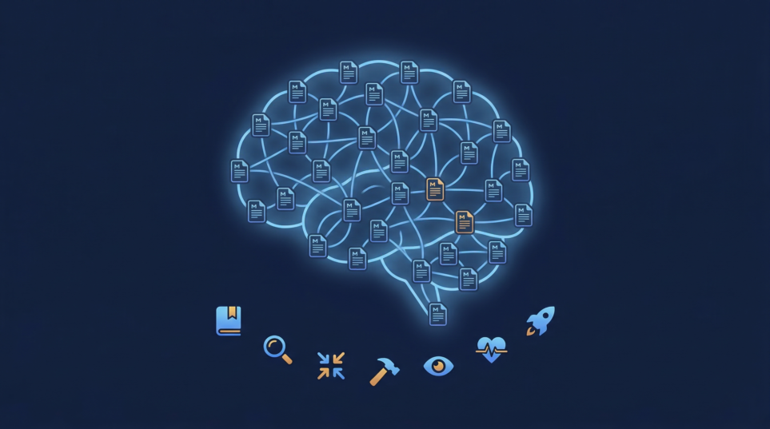
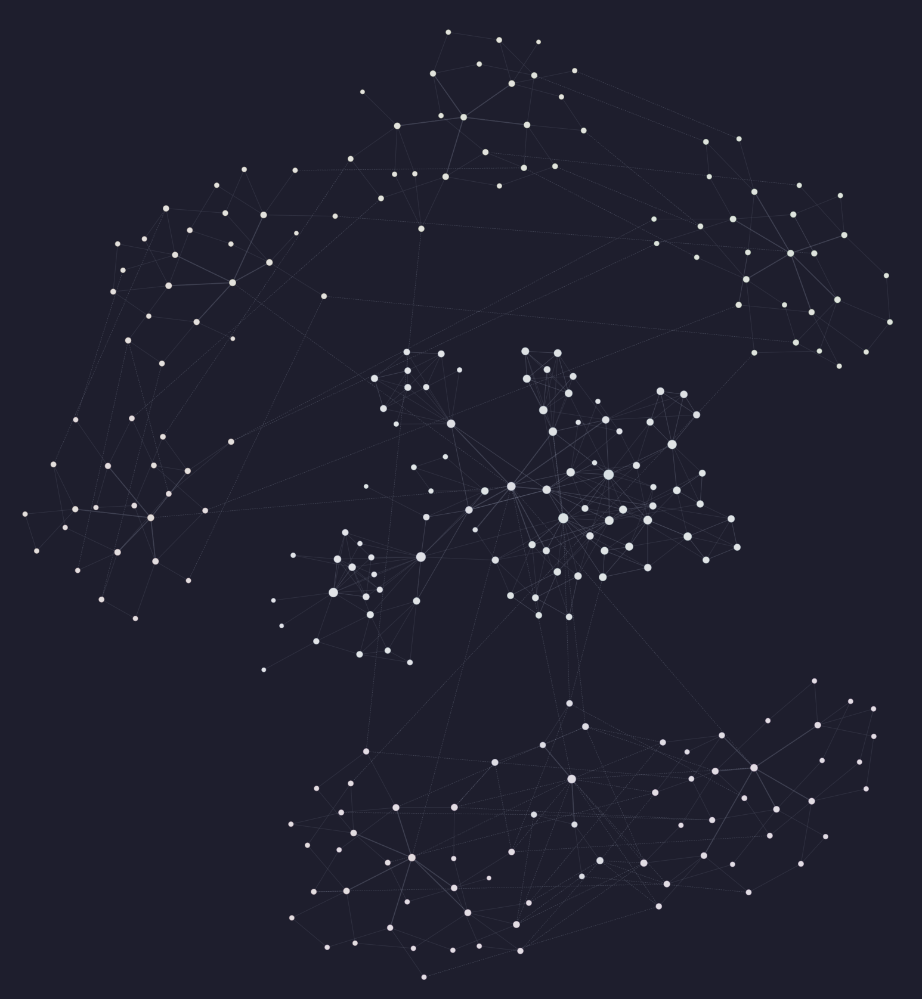

# Knowledge Skills




**Learn alongside the AI.** When you run `/kb-learn`, Claude doesn't just store text — it researches, cross-references, challenges claims, and builds a structured knowledge base that both of you can draw from. You learn, it learns, and every future conversation starts smarter.

> Looking for the installable plugin? See [knowledge-plugin](https://github.com/farzadshbfn/knowledge-plugin).

## Install

```bash
npx skills add farzadshbfn/knowledge-skills
```

Then run `/kb-bootstrap` to set up your first knowledge base.

## Why This Exists

LLMs forget everything between conversations. Context windows are expensive and finite. These skills solve both:

- **Knowledge that grows into skills** — **Tracks what you look up across conversations**. When the same topics keep surfacing — the same notes loaded repeatedly, the same patterns referenced — it automatically flags them as skill candidates. Your most-used knowledge evolves into dedicated, reusable skills without manual curation.
- **Token-efficient retrieval** — `/kb-find` uses a **4-tier progressive loading** system. It reads topic indexes first, then frontmatter, then TOCs, then full notes — only as deep as needed. Your entire KB is never dumped into context.
- **Near-deterministic data retrieval** — Python scripts (`kb_loader.py`, `validate_kb.py`, `track_kb_access.py`) handle indexing, validation, and access tracking — **saving tokens** by keeping mechanical work out of the LLM's context.
- **Persistent, structured memory** — Knowledge survives across conversations, projects, and machines. Plain markdown files you own.

## Skills

| Skill | Purpose |
|-------|---------|
| `/kb-learn` | Learn from articles, research topics, fix KB errors |
| `/kb-find` | Look up existing knowledge — **progressive, token-efficient loading** |
| `/kb-compact` | Reorganize — split oversized notes, unify terminology, fix indexes |
| `/kb-mint` | Convert KB topics into skills, package as distributable plugins |
| `/kb-view` | **Local web renderer** with fuzzy search, markdown rendering, and knowledge graph |
| `/kb-monitor` | Track access patterns, surface skill candidates, check skill health |
| `/kb-bootstrap` | First-time setup — run once per project |

## How It Works

### Learn — not just store

`/kb-learn` doesn't paste text into a file. It runs a **multi-agent pipeline**:

1. **Scouter** finds related notes in your KB (including counter-evidence via `--challenge`)
2. **Searcher** pulls context from the web
3. **Assessor** evaluates claims against your existing knowledge + web evidence
4. New or updated notes are written with proper cross-references and changelog entries

```
/kb-learn article <url>          # Extract and assess claims from an article
/kb-learn topic "raft consensus" # Research a topic, fill gaps in your KB
/kb-learn fix "X actually works like Y"  # Correct a mistake
```

After learning, ask Claude to summarize what it found, explain trade-offs, or compare against what you already knew.

### Find — context-aware retrieval

`/kb-find` **progressively loads only what's relevant**:

```
Tier 1 → Topic tree (names + descriptions only)
Tier 2 → Frontmatter scan (first 15 lines of candidates)
Tier 3 → TOC + targeted sections
Tier 4 → Full note read (only when necessary)
```

This means a lookup in a 10,000-line KB might only load 50 lines into context. Challenge mode (`--challenge`) actively looks for contradicting evidence.

### View — rendered in your browser

`/kb-view` starts a **local HTTP server** with a single-page app:

- Sidebar tree navigation across all configured KBs
- Fuzzy search across all notes
- Markdown rendering with syntax highlighting and Mermaid diagrams
- **Interactive knowledge graph** (d3-based) showing connections between notes
- Light/dark/system theme



### Compact and Evolve

`/kb-compact` keeps your KB healthy as it grows — splitting large notes, merging duplicates, unifying terminology, and rebuilding indexes. `--deep` mode traverses the entire KB bottom-up.

### From Knowledge to Skills — Automatically

As you use your KB, **access patterns are tracked across conversations**. When topics keep coming back — the same notes loaded repeatedly, the same questions asked in different contexts — they're flagged as **skill candidates**. These are topics mature enough that they'd be better served as a dedicated skill rather than a loose collection of notes.

`/kb-mint` then converts those candidates into standalone skills. The pipeline goes: raw notes → structured knowledge → reusable skill.

## Multi-KB Support — The Proximity Principle

Knowledge is most useful **where you need it**. A single centralized KB works until you're juggling multiple domains — then you're loading irrelevant context every time.

Multi-KB lets you **co-locate knowledge with the domain it serves**:

```json
// .claude/knowledge-base/config.json
{
  "kb_roots": [
    { "name": "core", "path": "./knowledge" },
    { "name": "frontend", "path": "./frontend/knowledge" },
    { "name": "infra", "path": "./infra/knowledge" }
  ]
}
```

Each KB lives next to its domain. When you `/kb-find`, it searches the most relevant KB first — **fewer tokens, faster retrieval, more relevant results**. When a concept spans domains, `@kb-name/path` cross-references link them without duplicating content.

This matters because **proximity drives retrieval quality**. The tighter the knowledge is scoped to the work at hand, the less noise the progressive loader has to filter through. A 200-note general KB is slower and less precise than three focused domain KBs with cross-links. You get centralization (everything is still connected) with the token efficiency of clustering.

## Architecture

```
knowledge/
  learn/       Multi-agent learning pipeline (scouter, searcher, assessor)
  find/        Progressive 4-tier loader with deterministic Python scripts
  compact/     KB restructuring and health checks
  mint/        Skill conversion and plugin packaging
  view/        Local web renderer (HTTP server + SPA + d3 graph)
  monitor/     Access tracking and skill candidate analysis
  bootstrap/   First-time project setup
```

**Data retrieval is near-deterministic** — Python scripts handle indexing, tree building, validation, and access tracking, saving tokens by keeping mechanical work out of the LLM's context. The LLM orchestrates workflows and makes judgment calls. The scripts do the rest.

---

Built by [Farzad Sharbafian](https://github.com/farzadshbfn)

[](https://x.com/farzadshbfn) — I share what I'm building, learning, and thinking about — mostly around AI, dev tools, and making agents actually useful
